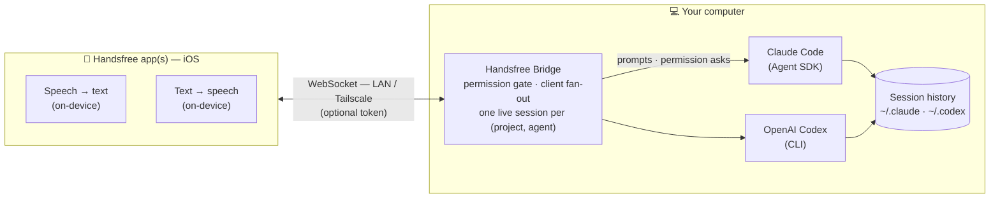

<p align="center">
  <picture>
    <source media="(prefers-color-scheme: dark)" srcset="assets/logo-dark.png">
    
  </picture>
</p>

<p align="center">
  <picture>
    <source media="(prefers-color-scheme: dark)" srcset="assets/wordmark-dark.png">
    
  </picture>
</p>

<p align="center"><b>Talk to your coding agent — hands-free, from your phone.</b></p>

<p align="center">English | <a href="README.zh-CN.md">简体中文</a></p>

<p align="center">
  
  
  
  
</p>

This is the self-hosted backend for the
[Handsfree](https://contraststudio.app/handsfree) iOS app: it runs on the
computer where your coding agent lives, drives it on your behalf, and exposes a
WebSocket your phone connects to.

> **100% on-device voice — and completely free.** Speech-to-text and
> text-to-speech run entirely on Apple's built-in, on-device engines inside the
> iOS app. There's no cloud voice API, no separate voice model to host, no
> subscription and no per-minute fees — nothing extra to pay for. Talk to your
> coding agent and hear it reply, fully hands-free, **anywhere and any time**.

- **Free, on-device voice.** All audio stays on the phone (Apple's built-in
  speech recognition + text-to-speech). No online voice model, no API keys for
  voice, no extra cost — the bridge itself is text-only.
- Drives **Claude Code** (via the [Claude Agent SDK](https://github.com/anthropics/claude-agent-sdk-typescript)) and **OpenAI Codex** (via the Codex CLI), side by side.
- Streams replies token-by-token and routes **tool-permission prompts** and **multiple-choice questions** to the phone — the bridge stays the permission gate.
- One live session per `(project, agent)`; multiple phones can view and drive the **same** session at once.
- LAN out of the box, or **Tailscale** for talking to your agent from anywhere. Optional shared-secret token.

The bridge speaks a plain text/JSON WebSocket protocol (see `src/protocol.ts`).

## Architecture



Audio stays on the phone; the bridge only moves text and tool-permission
prompts. Multiple phones attach to the **same** live session and stay in sync —
the bridge is the single writer (see [Sessions & concurrency](#sessions--concurrency)).

## Prerequisites

- **Node 20+**
- A coding agent installed and logged in:
  - **Claude Code**, logged in with a Claude Pro/Max subscription. Keep
    `ANTHROPIC_API_KEY` **unset** so it runs on your subscription rather than
    pay-as-you-go API billing.
  - and/or **OpenAI Codex** (see [Codex setup](#codex-setup) below). Optional.
- *(Optional, for remote access)* [Tailscale](https://tailscale.com) on both the
  computer and the phone, signed in to the same account.

## Setup

Three quick steps — the same ones the app walks you through.

### 1. Start the bridge

On the computer where your coding agent runs, install and start the bridge, then
leave it running:

```bash
git clone https://github.com/devtheicetea/handsfree.git
cd handsfree
npm install && npm run build
npm start
```

Needs Node 20+, with your coding agent installed and logged in (see
[Prerequisites](#prerequisites)).

### 2. Connect your phone

- **On the same Wi-Fi** — if your phone and computer share a network, there's
  nothing to set up.
- **Away / remote** — install [Tailscale](https://tailscale.com) on both the
  computer and the phone and sign in to the same account. The bridge then
  advertises your Tailscale address automatically and the phone reaches it from
  anywhere — no port forwarding. Leave the default `HANDSFREE_BIND=0.0.0.0`, or
  set it to your Tailscale IP to refuse all other interfaces.

The advertised host is chosen automatically: your **Tailscale** IP if available,
otherwise your **LAN** IP, otherwise `localhost`. Override it with
`HANDSFREE_HOST` (see [Configuration](#configuration)).

### 3. Pair the app

On start, the bridge prints a **pairing QR code** and a `handsfree://connect?…`
URL in its terminal, with the host and port (default **8744**) beneath it. In the
[Handsfree app](https://contraststudio.app/handsfree):

- tap **Scan QR Code** and point the camera at it, or
- tap **Enter connection manually** and type the host and port shown.

That's it — start talking to your coding agent, hands-free.

## Configuration

All configuration is via environment variables:

| Variable | Default | Description |
| --- | --- | --- |
| `HANDSFREE_PORT` | `8744` | Listen port. |
| `HANDSFREE_BIND` | `0.0.0.0` | Bind address. Set to your Tailscale IP to listen only there. |
| `HANDSFREE_HOST` | auto | Host advertised in the pairing QR/URL. Auto = Tailscale IP → LAN IP → `localhost`. |
| `HANDSFREE_TOKEN` | _(none)_ | Optional shared secret; the client must send it in its `hello`. |
| `HANDSFREE_SAFELIST` | `Read,Grep,Glob,LS,TodoWrite,CodexApplyPatch` | Comma-separated tools auto-approved in `safelist` permission mode. |
| `HANDSFREE_MODEL` | _(SDK default)_ | Model for Claude sessions (e.g. `sonnet`, `opus`, or a full model id). |
| `HANDSFREE_CODEX_PATH` | resolve from `PATH` | Full path to the `codex` binary. |

## Permissions

Every tool call is gated. Each session runs in one of three modes, switchable
from the phone:

- **safelist** — tools in `HANDSFREE_SAFELIST` auto-approve; everything else asks.
- **ask_all** — every tool call prompts on the phone.
- **auto** — everything auto-approves (use with care).

The bridge is always the gate: prompts stream to the connected client(s) and the
agent waits for an Allow / Allow-for-session / Deny answer.

## Agents

Clients pick the agent per `open_session` with `agent: "claude" | "codex"`
(defaults to `"claude"`). Claude and Codex sessions run side by side — one live
session per `(project, agent)`.

### Codex setup

- Install the Codex CLI (`npm i -g @openai/codex` or `brew install codex`) and
  log in (`codex login`). The bridge resolves `codex` from `PATH`; override with
  `HANDSFREE_CODEX_PATH=/path/to/codex`.
- Codex runs sandboxed (workspace-write) with approvals on request; the bridge
  remains the permission gate. Commands always ask (`CodexExec`); file changes
  inside the project auto-allow in safelist mode (`CodexApplyPatch`), outside the
  project ask (`CodexApplyPatchOutside`).
- Codex sessions are discovered, resumed, and replayed from `~/.codex/sessions`.

## Sessions & concurrency

The bridge assumes the cardinal rule of Claude Code / the Agent SDK: **exactly
one live process may write to a session's history at a time.** Two live writers
on one session produce interleaved, divergent, or corrupt history. Everything
below is a strategy to respect that rule.

- **Many phones, one session, at the same time → yes.** Multiple Handsfree
  clients subscribe to the same single bridge-owned session and fan out: there's
  still one live writer (the bridge), and the phones are just synchronized views
  with input.
- **Phone joining a session your terminal is running (mirror) → safe by forking.**
  The phone watches the live CLI session read-only; on its first prompt the
  bridge **forks a new session id** (copies the history, then diverges) instead
  of becoming a second writer on the terminal's session.
- **Resuming a bridge session in your terminal (`claude --resume <id>` /
  `codex resume`) → sequential handoff only.** This continues the *same* id (no
  fork), so **stop the bridge first** to release the session, then resume in the
  terminal. Running the bridge and a terminal resume on one id simultaneously is
  two writers — don't.

In short: *same live session on multiple devices at once* is supported through
the bridge's fan-out; *the bridge and a native resume co-driving one id* is not.

## Security

- The bridge has no auth beyond an optional `HANDSFREE_TOKEN`. Don't expose it to
  the public internet. Bind to localhost/LAN, or use **Tailscale** so only your
  own devices can reach it.
- The agent runs with your local permissions in the chosen project directory.
  Pick your permission mode accordingly.

## Tests

```bash
npm test                          # unit tests
HANDSFREE_E2E=1 npm test          # also runs the real Agent SDK text-loop (needs Claude login)
npm run typecheck                 # type-check without emitting
```

## Manual text-loop client

A terminal client for poking the bridge without the app. With the bridge
running, in another terminal:

```bash
node test/client.ts               # Node 22.6+ (built-in TS). Otherwise: npx tsx test/client.ts
```

Then: pick a project → type a prompt → watch streamed text → answer permission
prompts. Commands: `/auto`, `/ask`, `/abort`, `/quit`.

## License

[MIT](LICENSE) © Contrast Studio LLC
