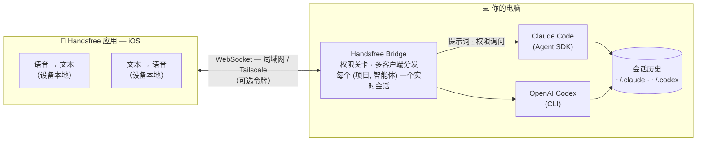

<p align="center">
  <picture>
    <source media="(prefers-color-scheme: dark)" srcset="assets/logo-dark.png">
    
  </picture>
</p>

<p align="center">
  <picture>
    <source media="(prefers-color-scheme: dark)" srcset="assets/wordmark-dark.png">
    
  </picture>
</p>

<p align="center"><b>用语音与你的编程智能体对话——解放双手，随时随地。</b></p>

<p align="center"><a href="README.md">English</a> | 简体中文</p>

<p align="center">
  
  
  
  
</p>

这是 [Handsfree](https://contraststudio.app/handsfree) iOS 应用的自托管后端：
它运行在你的编程智能体所在的电脑上，代表你驱动该智能体，并对外暴露一个供手机连接的 WebSocket。

> **100% 设备本地语音——而且完全免费。** 语音识别与文字转语音都在 iOS 应用内、
> 使用 Apple 内置的设备本地引擎运行。没有云端语音 API，无需自建语音模型，没有订阅、
> 也没有按分钟计费——不需要为语音额外付费。与你的编程智能体对话、听它回复，
> 全程解放双手，**随时随地**。

- **免费的设备本地语音。** 所有音频都留在手机上（Apple 内置的语音识别 + 文字转语音）。
  没有在线语音模型，语音无需 API key，也没有额外费用——桥接服务本身只处理文本。
- 同时驱动 **Claude Code**（通过 [Claude Agent SDK](https://github.com/anthropics/claude-agent-sdk-typescript)）和 **OpenAI Codex**（通过 Codex CLI）。
- 逐字流式返回回复，并将 **工具权限请求** 和 **多选问题** 转发到手机——桥接服务始终是权限关卡。
- 每个 `(项目, 智能体)` 只有一个实时会话；多部手机可以同时查看并驱动**同一个**会话。
- 默认支持局域网，或使用 **Tailscale** 随时随地与你的智能体对话。可选的共享密钥令牌。

桥接服务使用纯文本/JSON 的 WebSocket 协议（见 `src/protocol.ts`）。

## 架构



音频始终留在手机上；桥接服务只传输文本和工具权限请求。多部手机连接到**同一个**
实时会话并保持同步——桥接服务是唯一的写入方（见
[会话与并发](#会话与并发)）。

## 前置条件

- **Node 20+**
- 已安装并登录的编程智能体：
  - **Claude Code**，使用 Claude Pro/Max 订阅登录。请保持 `ANTHROPIC_API_KEY`
    **未设置**，这样它会走你的订阅，而不是按量计费的 API。
  - 以及/或 **OpenAI Codex** — 安装 Codex CLI（`npm i -g @openai/codex` 或
    `brew install codex`）并运行 `codex login`。可选。
- *（可选，用于远程访问）* 在电脑和手机上都安装 [Tailscale](https://tailscale.com)，
  并登录同一账户。

## 设置

三个简单步骤——与应用引导你完成的步骤一致。

### 1. 启动桥接服务

在运行你编程智能体的电脑上，安装并启动桥接服务，然后让它保持运行：

```bash
git clone https://github.com/devtheicetea/handsfree.git
cd handsfree
npm install && npm run build
npm start
```

需要 Node 20+，并已安装并登录你的编程智能体（见 [前置条件](#前置条件)）。

### 2. 连接你的手机

- **同一 Wi-Fi 下** — 如果手机和电脑在同一网络，无需任何设置。
- **外出 / 远程** — 在电脑和手机上都安装 [Tailscale](https://tailscale.com) 并登录同一账户。
  桥接服务会自动公布你的 Tailscale 地址，手机即可随时随地连接——无需端口转发。
  保持默认的 `HANDSFREE_BIND=0.0.0.0`，或将其设为你的 Tailscale IP 以拒绝其他网络接口。

对外公布的主机会自动选择：优先 **Tailscale** IP，其次 **局域网** IP，最后 `localhost`。
可通过 `HANDSFREE_HOST` 覆盖（见 [配置](#配置)）。

### 3. 配对应用

启动时，桥接服务会在终端打印一个**配对二维码**和一个 `handsfree://connect?…` 链接，
下方附有主机和端口（默认 **8744**）。在 [Handsfree 应用](https://contraststudio.app/handsfree) 中：

- 点按**扫描二维码**并用相机对准它，或
- 点按**手动输入连接信息**，输入显示的主机和端口。

完成——开始解放双手，与你的编程智能体对话。

## 配置

所有配置均通过环境变量完成：

| 变量 | 默认值 | 说明 |
| --- | --- | --- |
| `HANDSFREE_PORT` | `8744` | 监听端口。 |
| `HANDSFREE_BIND` | `0.0.0.0` | 绑定地址。设为你的 Tailscale IP 即可只在该接口监听。 |
| `HANDSFREE_HOST` | 自动 | 配对二维码/链接中公布的主机。自动 = Tailscale IP → 局域网 IP → `localhost`。 |
| `HANDSFREE_TOKEN` | _（无）_ | 可选的共享密钥；客户端必须在 `hello` 中发送它。 |
| `HANDSFREE_SAFELIST` | `Read,Grep,Glob,LS,TodoWrite,CodexApplyPatch` | 在 `safelist` 权限模式下自动批准的工具，逗号分隔。 |
| `HANDSFREE_MODEL` | _（SDK 默认）_ | Claude 会话使用的模型（如 `sonnet`、`opus`，或完整模型 id）。 |
| `HANDSFREE_CODEX_PATH` | 从 `PATH` 解析 | `codex` 可执行文件的完整路径。 |
| `HANDSFREE_ENV` | `prod` | 运行模式。`debug` 开启每条消息的详细控制台日志；`prod` 保持控制台安静。 |

## 权限

每一次工具调用都会被把关。每个会话运行在三种模式之一，可从手机切换：

- **safelist** — `HANDSFREE_SAFELIST` 中的工具自动批准；其余都询问。
- **ask_all** — 每一次工具调用都在手机上提示。
- **auto** — 全部自动批准（请谨慎使用）。

桥接服务始终是关卡：提示会流式发送到已连接的客户端，智能体会等待
允许 / 本次会话允许 / 拒绝 的回答。

## 会话与并发

桥接服务遵循 Claude Code / Agent SDK 的根本原则：**同一时刻只能有一个实时进程
写入某个会话的历史。** 同一会话上有两个实时写入方会产生交错、分叉或损坏的历史。
下面的一切都是为遵守这条规则而设计的策略。

- **多部手机，同一会话，同时进行 → 可以。** 多个 Handsfree 客户端订阅同一个由桥接
  服务拥有的会话并进行分发：实时写入方仍然只有一个（桥接服务），手机只是带输入的同步视图。
- **手机加入你终端正在运行的会话（镜像）→ 通过分叉来保证安全。** 手机以只读方式
  观察终端的实时会话；在它发出第一条提示时，桥接服务会**分叉出一个新的会话 id**
  （复制历史，然后分叉），而不是成为终端会话上的第二个写入方。
- **在终端中恢复桥接服务拥有的会话（`claude --resume <id>` / `codex resume`）→ 仅限顺序交接。**
  这会继续**同一个** id（不分叉），所以请**先停止桥接服务**以释放会话，再在终端中恢复。
  桥接服务与终端恢复同时作用于同一个 id 就是两个写入方——不要这样做。

简而言之：*同一实时会话在多部设备上同时使用*，通过桥接服务的分发是支持的；
*桥接服务与原生 resume 同时驱动同一个 id*，则不支持。

## 安全

- 除了可选的 `HANDSFREE_TOKEN`，桥接服务没有其他鉴权。不要把它暴露到公网。
  绑定到 localhost/局域网，或使用 **Tailscale**，让只有你自己的设备能访问它。
- 智能体以你的本地权限在所选项目目录中运行。请据此选择权限模式。

## 许可证

[MIT](LICENSE) © Contrast Studio LLC
